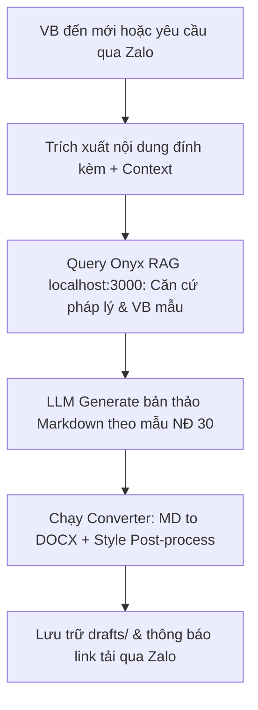

# F9 — Dự thảo văn bản trả lời (.docx)

**Trạng thái:** 🚧 Thiết lập kế hoạch chi tiết | **Cập nhật:** 2026-06-22 ICT

**Tích hợp bộ Skill Văn phòng:**
Sử dụng bộ kỹ năng văn phòng [xu-ly-van-phong](file:///d:/Antigravity/Hermes/docs/xu-ly-van-phong.md) (đặc biệt là chuẩn **NĐ 30** và **python-docx / MD→DOCX pipeline**) để tạo file dự thảo chuẩn xác, tránh lỗi định dạng và font chữ tùy ý.

**Tích hợp Hệ thống Onyx RAG:**
Mã nguồn Onyx đang được triển khai tại `D:\Antigravity\Onyx\onyx` (Git: https://github.com/onyx-dot-app/onyx), truy cập nội bộ thông qua `http://localhost:3000`. Onyx đóng vai trò cung cấp Search & RAG API để LLM có thể tham chiếu các văn bản chỉ đạo cũ và lấy context tạo dự thảo chính xác.

**Kế hoạch triển khai:**

#### 1. Pipeline xử lý tự động (5 Bước):


- **Bước 1: Trích xuất thông tin đầu vào:** Lấy thông tin trích yếu, số ký hiệu, tác giả từ `vbden_state.json`. Nếu có file đính kèm đã tải (F16a), trích xuất text (F16b) để LLM đọc nội dung chi tiết.
- **Bước 2: Tìm kiếm ngữ cảnh (Onyx RAG):**
  - Gửi truy vấn API tới hệ thống Onyx đang chạy tại `http://localhost:3000` để lấy các văn bản pháp quy liên quan, các công văn chỉ đạo trước đó hoặc công văn mẫu của đơn vị.
- **Bước 3: Dự thảo bản thảo Markdown:**
  - LLM viết bản thảo dưới định dạng Markdown, phân chia rõ ràng các phần hành chính (Quốc hiệu, Tên cơ quan, Số ký hiệu, Nơi nhận, Kính gửi, Nội dung, Chức danh người ký).
  - Sử dụng template mẫu `templates/docx-hanh-chinh-cong-van.md` từ bộ skill văn phòng.
- **Bước 4: Xuất bản file Word (.docx) chuẩn NĐ 30:**
  - Chuyển đổi Markdown sang DOCX qua script `scripts/convert/convert_md_to_docx.py`.
  - Áp dụng các định dạng lề (margin), font (Times New Roman), cỡ chữ (13-14), khoảng cách dòng (line spacing 1.15 - 1.5) theo quy chuẩn `standards/nd30.md`.
  - Định dạng header 2 cột (Cột 1: Cơ quan chủ quản & Cơ quan ban hành; Cột 2: Quốc hiệu tiêu ngữ) và phần ký tên/nơi nhận chính xác.
- **Bước 5: Lưu trữ và gửi Zalo:**
  - File được lưu vào `~/.hermes/cron/cong-van-den/drafts/{so_den}_draft.docx`.
  - Gửi thông báo Zalo kèm link/nút bấm tải trực tiếp.

#### 2. Cấu trúc lưu trữ:
```
drafts/
├── 2410_4134-SYT-NVY_draft.docx
├── 2387_4133-SYT-NVY_draft.docx
└── ...
```

#### 3. Cấu hình & Thư viện yêu cầu:
- File cấu hình trong `.env`:
  ```ini
  CONGVAN_DRAFT_AUTO=1              # Tự động tạo dự thảo khi có công văn mới
  CONGVAN_ORG_NAME="SỞ Y TẾ"         # Tên cơ quan ban hành mặc định
  CONGVAN_SIGNER_NAME="Nguyễn Văn A" # Tên người ký mặc định
  CONGVAN_SIGNER_TITLE="GIÁM ĐỐC"    # Chức danh người ký mặc định
  ONYX_API_URL="http://localhost:3000/api" # Địa chỉ nội bộ của Onyx
  ```
- Dependencies: `python-docx`, `openpyxl`, `pandoc` (đã cài đặt trong môi trường).
