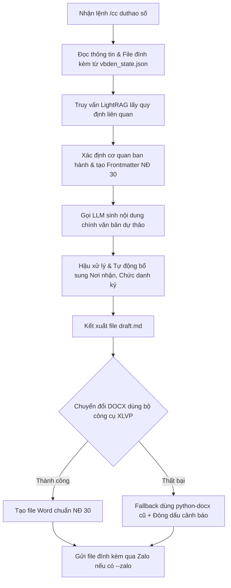

# Tài liệu Pipeline Dự thảo Văn bản (`/cc duthao`) và Vai trò của bộ công cụ XLVP

Tài liệu này mô tả chi tiết luồng xử lý (pipeline) của lệnh `/cc duthao <số>` thuộc skill `congchuc` và vai trò của cấu phần `xlvp` trong quy trình tạo văn bản hành chính đạt chuẩn Nghị định 30/2020/NĐ-CP.

---

## 1. Sơ đồ Pipeline Xử lý của lệnh `/cc duthao <số>`

Khi người dùng thực thi lệnh `/cc duthao <số>` hoặc đưa ra câu lệnh ngôn ngữ tự nhiên tương đương, Hermes Agent sẽ chạy script [congchuc_draft.py](file:///d:/Antigravity/Hermes/skills/cc/scripts/congchuc_draft.py) để thực hiện quy trình sau:

### Chi tiết các bước:

1. **Trích xuất thông tin văn bản đến (Extract Info)**:
   * Đọc trạng thái từ cơ sở dữ liệu/file trạng thái của công văn đến (`vbden_state.json`).
   * Trích xuất các trường dữ liệu cần thiết như: trích yếu, tác giả, số ký hiệu văn bản đến, bút phê của lãnh đạo, ngày văn bản, hạn xử lý.
   * Chuyển đổi và trích xuất nội dung văn bản thuần từ tất cả các file tài liệu đính kèm (hỗ trợ các định dạng `.md`, `.txt`, `.docx`, `.pdf`) bằng hàm [extract_text_from_file()](file:///d:/Antigravity/Hermes/skills/cc/scripts/congchuc_draft.py#L77-L96).

2. **Truy vấn cơ sở tri thức (Query LightRAG)**:
   * Gọi API LightRAG qua hàm [query_lightrag()](file:///d:/Antigravity/Hermes/skills/cc/scripts/congchuc_draft.py#L64-L74) với từ khóa trích yếu để lấy các văn bản pháp luật, quy chế phối hợp hoặc quy định nghiệp vụ liên quan nhằm hỗ trợ quá trình soạn thảo chuẩn xác.

3. **Thiết lập thông tin Cơ quan ban hành & Dựng Frontmatter**:
   * Dựa vào mã đơn vị xử lý (`unit_id`), hệ thống gọi hàm [resolve_org_for_unit()](file:///d:/Antigravity/Hermes/skills/cc/scripts/congchuc_draft.py#L33-L61) để lấy thông tin Tên cơ quan chủ quan, Tên cơ quan ban hành, và Mã định danh cơ quan nhằm thiết lập cấu trúc metadata (Frontmatter) chuẩn Nghị định 30.

4. **Gọi LLM sinh nội dung dự thảo (LLM Draft Generation)**:
   * Ghép System Prompt chứa các chỉ thị nghiêm ngặt về phong cách hành chính nhà nước (ví dụ: chỉ bắt đầu bằng *Kính gửi...*, dùng từ ngữ trang trọng, không in đậm số thứ tự danh sách, định dạng khối chữ ký rõ ràng) cùng với dữ liệu công văn đến và tri thức LightRAG.
   * Gửi yêu cầu tới mô hình ngôn ngữ (LLM) để tạo ra phần nội dung chính của văn bản dự thảo phản hồi.

5. **Hậu xử lý mã nguồn (Programmatic Cleanup)**:
   * Thực hiện loại bỏ tự động các định dạng Markdown không tương thích (như in đậm tiêu đề số thứ tự hoặc dấu gạch đầu dòng dư thừa).
   * Kiểm tra và tự động chèn thêm khối **Nơi nhận** và **Chức danh người ký** (Ví dụ: GIÁM ĐỐC) nếu LLM bỏ sót để đảm bảo cấu trúc văn bản đầu ra.
   * Kết xuất file Markdown dự thảo hoàn chỉnh (`draft.md`).

6. **Chuyển đổi sang tài liệu Word chuẩn Nghị định 30 (DOCX Conversion)**:
   * Gọi hàm [convert_to_docx_xlvp()](file:///d:/Antigravity/Hermes/skills/cc/scripts/congchuc_draft.py#L193-L213) để chuyển đổi từ Markdown sang cấu trúc JSON rồi dùng công cụ của **XLVP** biên dịch ra file `.docx`.
   * **Cơ chế Fallback**: Nếu XLVP gặp lỗi, script tự động chuyển sang luồng chuyển đổi cũ [convert_to_docx_legacy()](file:///d:/Antigravity/Hermes/skills/cc/scripts/congchuc_draft.py#L215-L245) dùng thư viện `python-docx` thông thường và đóng dấu watermark cảnh báo người dùng.

7. **Gửi kết quả qua Zalo (Zalo Integration)**:
   * Nếu có cờ `--zalo`, script dịch đường dẫn từ Docker Container sang Windows Host dựa trên cấu hình môi trường và gửi file qua API của Zalo Plugin.

---

## 2. Vai trò của `D:\Antigravity\xlvp` trong Pipeline

Thư mục `D:\Antigravity\xlvp` chứa mã nguồn và tài nguyên của bộ công cụ **XLVP** (được phát triển xung quanh core **OfficeCLI**). Vai trò của nó trong pipeline này là:

* **Định dạng chuẩn Nghị định 30/2020/NĐ-CP**:
  * Định dạng bố cục trang giấy (Page Margins: lề trên, dưới, trái, phải).
  * Sử dụng font chữ Times New Roman và cỡ chữ chuẩn quy định cho từng cấu phần tài liệu.
  * Kẻ bảng ẩn (borderless tables) để chia bố cục Quốc hiệu - Tiêu ngữ và Tên cơ quan ban hành ở phần đầu trang, cũng như căn lề song song cho mục *Nơi nhận* và *Chữ ký* ở cuối văn bản đúng quy chuẩn pháp luật Việt Nam.
* **Biên dịch cấu trúc dữ liệu**:
  * Khi `congchuc_draft.py` trích xuất file Markdown thành file JSON trung gian (`_nd30.json`), script `/opt/xlvp/nd30-document-drafter/scripts/generate_nd30_docx.js` (hoặc thư viện wrapper Python `xlvp-py`) sẽ đọc cấu trúc JSON này để dựng trực tiếp các Node XML trong file Word OpenXML (.docx), đảm bảo tính chính xác và tránh bị vỡ khung tài liệu.
* **Single Source of Truth**:
  * Lưu trữ định nghĩa cấu trúc chuẩn trong file cấu hình (ví dụ: `standards/nd30.json`), giúp dễ dàng điều chỉnh định dạng văn bản hành chính theo quy định mới mà không phải thay đổi mã nguồn logic nghiệp vụ của Agent.
