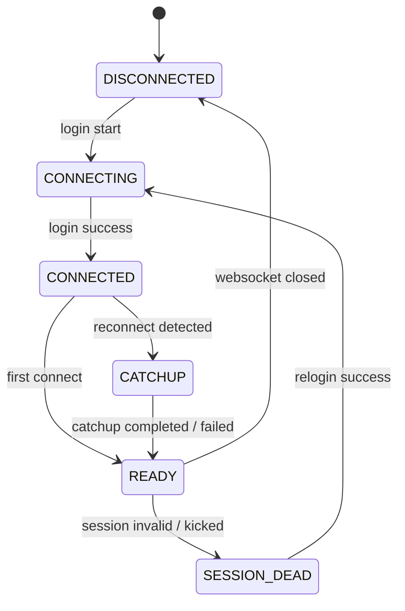

# Architecture Design Document: Reliable Message Recovery & Catch-up (v8)

> **Thay đổi so với v7:** Vá 1 lỗi nghiêm trọng bị bỏ sót (self-loop), xác nhận chính thức việc thu hẹp scope thành "Group-only catch-up" do giới hạn API từ thư viện gốc, và **thu gọn scope** từ 6 PR xuống 3 PR để tương xứng với quy mô thực tế của Hermes (trợ lý cá nhân/gia đình, vài chục thread — không phải hệ thống messaging doanh nghiệp).

---

## 📌 RFC 2119 Conformance Notice

The key words "MUST", "MUST NOT", "REQUIRED", "SHALL", "SHALL NOT", "SHOULD", "SHOULD NOT", "RECOMMENDED", "MAY", and "OPTIONAL" in this document are to be interpreted as described in [RFC 2119](https://www.ietf.org/rfc/rfc2119.txt).

---

## 🚨 Kết Quả Xác Minh Khả Thi (Feasibility Verification Result)

Sau quá trình kiểm tra thực tế thư viện `zca-js`, kết quả xác minh API lịch sử như sau:

| Tiêu chí | Group History (type: 2) | DM History (type: 1) |
| :--- | :--- | :--- |
| **API tồn tại?** | ✅ Có (REST 404 nhưng có WS fallback) | ❌ Không có API tương đương |
| **Field uidFrom/sender?** | ✅ Có trong response của Group | ❌ N/A |
| **Khả thi cho catch-up?** | ✅ Khả thi | ❌ BẤT KHẢ THI |

**Kết luận:** Chốt scope của toàn bộ tính năng Catch-up là **"Group-only catch-up"**. 
Việc không hỗ trợ Catch-up cho tin nhắn Chat 1-1 (DM) là **giới hạn cứng từ upstream (zca-js)** do không có API trích xuất lịch sử cá nhân. Đây không phải là một khiếm khuyết trong quá trình triển khai (implementation gap) và không thể khắc phục trong các phiên bản cập nhật tiếp theo trừ khi thư viện lõi hỗ trợ.

---

## 🚨 Critical Fix: Self-Message Filtering (self-loop prevention)

Đây là lỗi nghiêm trọng nhất bị bỏ sót qua các bản v1–v7 trước, **MUST** được xử lý ngay từ PR #3, không được hoãn:

* History API trả về **toàn bộ 2 chiều hội thoại**, bao gồm cả tin nhắn mà chính bot (tài khoản Zalo đang chạy Hermes) đã tự gửi trước đó — kể cả các câu trả lời do chính Hermes Agent sinh ra.
* Nếu `_normaliseHistoryMessage()` không lọc bỏ các bản ghi có `senderId === this.ownId` (hoặc field tương đương xác nhận ở bước Pre-Implementation Verification), catch-up sẽ emit lại **câu trả lời cũ của chính bot** như một tin nhắn mới → Hermes Agent xử lý và trả lời lại → tin trả lời mới lại nằm trong lịch sử → lần catch-up kế tiếp (network chập chờn) lại thấy → **vòng lặp bot tự chat với chính mình**, tệ nhất là leo thang nhanh nếu mạng rớt liên tục.
* **Yêu cầu bắt buộc:** `_normaliseHistoryMessage(rawMsg, threadId, threadType)` **MUST** áp dụng đúng bộ lọc `isSelf`/`senderId === ownId` giống hệt logic đã có trong `_normaliseMessage()` của đường live, trước khi đưa message vào pipeline dedup/emit.

---

## 📌 Context & Architecture Assumptions

`zca-js` không cung cấp cơ chế replay các sự kiện WebSocket bị bỏ lỡ. Khi kết nối WebSocket bị rớt trong lúc `retryOnClose`/auto-relogin, các tin nhắn gửi tới trong khoảng thời gian này sẽ không được tự động phát lại qua listener — khác với Telegram Bot API vốn có hàng đợi update phía server.

Vì vậy, Bridge Node.js **MUST** chủ động đọc lại lịch sử hội thoại để bù các khoảng trống dữ liệu sau khi kết nối được khôi phục — với điều kiện tiên quyết là mục "Pre-Implementation Verification" ở trên đã được xác nhận.

---

## 🎯 Design Goals

* **Never lose live messages after reconnect:** khôi phục tối đa tin nhắn bị nhỡ trong khoảng thời gian socket gián đoạn (cho các thread đã xác nhận có History API khả dụng).
* **Never emit bot's own past messages back into the pipeline** (self-loop prevention — xem mục Critical Fix).
* **Never crash due to corrupted checkpoint:** tự động degrade gracefully nếu file checkpoint mất/hỏng.
* **Upstream-driven replay ordering:** bảo toàn thứ tự thời gian do History API cung cấp.
* **Degrade gracefully under failures:** cô lập lỗi ở cấp độ từng thread/API call, không làm gián đoạn toàn hệ thống.
* **Zero thundering herd on upstream APIs:** dùng hàng đợi tuần tự, rate limiting, jitter để tránh bị Zalo đánh dấu bất thường.
* **Right-sized for actual scale:** thiết kế cho quy mô thực tế (vài chục thread cá nhân/gia đình + vài đồng nghiệp), không xây dựng hạ tầng cho quy mô doanh nghiệp chưa cần tới.

---

## 🔒 Security Considerations

* **No Credentials in Logs/Metrics:** cookie, credentials, IMEI, token Zalo **MUST NOT** xuất hiện trong log hoặc `/health`.
* **No Message Content in Checkpoint/Metrics:** nội dung văn bản tin nhắn **MUST NOT** được lưu vào `thread_checkpoint.json` hoặc phơi bày qua `/health` — chỉ lưu `messageId`/`timestamp`.
* **Sanitized Health Output:** thông tin checkpoint xuất ra `/health` chỉ chứa trạng thái boolean/số liệu tổng hợp, không rò rỉ path đĩa nội bộ.

---

## 🧩 Compatibility

* **Node.js:** `>= 18.x` (khuyến nghị `>= 20.x`).
* **Upstream:** phụ thuộc vào kết quả xác minh ở mục "Pre-Implementation Verification" — nếu `zca-js` không hỗ trợ History API cho DM, phần DM coi như out of scope cho tới khi có giải pháp khác.
* **Hermes Agent:** tương thích ngược hoàn toàn với `ZaloAdapter` (Python) hiện có — không đổi giao thức SSE/`/api` đang dùng.
* **Backward Configuration:** hành vi mặc định giữ nguyên nếu không set các env var catch-up mới (opt-in).

---

## 🚫 Out of Scope (cho v8 — có thể xem xét ở bản sau nếu thực tế cần)

* **Dedicated `/metrics` endpoint riêng biệt:** gộp chung vào `/health` hiện có là đủ ở quy mô này.
* **LRU thread pruning:** với vài chục thread active, một `Map` thường không bao giờ cần eviction — chỉ thêm khi số thread thực tế vượt ngưỡng gây vấn đề rõ ràng.
* **Performance benchmark suite (100 threads / 5.000 tin nhắn burst):** kịch bản này không phản ánh use-case thực tế (cá nhân/gia đình + công chức). Không đầu tư effort vào đây cho tới khi có bằng chứng cần thiết.
* **End-to-end ACK giữa Python Adapter & Node Bridge:** checkpoint ở Bridge chỉ xác nhận tin nhắn đã "forwarded", chưa xác nhận Agent xử lý xong.
* **Exactly-once delivery:** hệ thống hướng tới At-Least-Once + Deduplication, không cam kết Exactly-Once.
* **Cross-device / multi-account / HA clustering:** không trong phạm vi — Bridge vẫn chạy single-instance.

---

## ⚠️ Known Limitations

* **DM catch-up không được hỗ trợ bởi zca-js** — đây là giới hạn từ upstream (thư viện lõi không có API cho DM history), **không phải implementation gap có thể fix sau**. DM catch-up sẽ không khả thi trong bất kỳ phiên bản tương lai nào trừ khi chính thư viện `zca-js` bổ sung hỗ trợ.
* **History API Depth Limitation:** Zalo History API chỉ trả về tối đa N tin nhắn gần nhất — rớt mạng quá lâu (vượt độ sâu history) sẽ có tin nhắn không khôi phục được.
* **Forwarded Checkpoint Semantics:** checkpoint **MUST** chỉ advance sau khi tin nhắn đã forward thành công tới downstream adapter.
* **Upstream Schema Drift:** nếu `zca-js`/Zalo Web API đổi cấu trúc response, logic catch-up cần cập nhật theo.
* **Ring buffer 200-item ở `server.js` (đã có từ fix SSE replay trước đó):** nếu catch-up dội nhiều tin nhắn cùng lúc, có thể tự làm tràn/evict ring buffer này trước khi adapter kịp tiêu thụ. Xem mục "Coordination with Existing SSE Ring Buffer" bên dưới — **MUST** xử lý phối hợp, không để 2 cơ chế giẫm chân nhau.

---

## 💥 Failure Matrix

| Failure Mode | Root Cause / Trigger | Expected System Behavior |
|---|---|---|
| WebSocket Disconnect | Network glitch / Proxy drop | Trigger `retryOnClose`; chuyển state `DISCONNECTED`. |
| Checkpoint Corrupted | Mất điện đột ngột / JSON invalid | Log warning, reset checkpoint về `{ version: 1, threads: {} }`, tắt catch-up cho session này; **MUST NOT** crash tiến trình. |
| History API Timeout | Zalo server latency | Retry tối đa 3 lần, exponential backoff ± 20% jitter. |
| History Retry Exhausted | Upstream API lỗi liên tục | `console.warn`, bỏ qua thread hiện tại, tiếp tục các thread còn lại. |
| Rate Limit Suspected | Gọi API upstream quá nhiều | Tạm dừng info call mới, backoff tăng dần (tối đa 5 phút), phục vụ cache cũ. |
| History message from self | Bot's own past reply appears in history | **MUST** filter out via `senderId === ownId` before dedup/emit (xem Critical Fix). |
| Catch-up overlaps with ring buffer | Nhiều tin nhắn catch-up dội cùng lúc vào SSE ring 200-item | Catch-up path **MUST** đẩy qua kênh có kiểm soát riêng (xem Coordination section), không dội thẳng làm evict tin live. |

---

## 📐 Reference Implementation Details

### 1. State Machine & Connection Lifecycle



| Current State | Trigger Event | Next State | Description / Action |
|---|---|---|---|
| `DISCONNECTED` | `login success` | `CONNECTED` | WebSocket kết nối thành công |
| `CONNECTED` | `reconnect detected` | `CATCHUP` | Phát hiện vừa reconnect sau khi rớt mạng (không phải lần khởi động đầu tiên — dùng cờ `_hasConnectedOnce`) |
| `CONNECTED` | `first connect` | `READY` | Kết nối lần đầu khi khởi động app — **KHÔNG** chạy catch-up |
| `CATCHUP` | `catchup completed` | `READY` | Quét bù hoàn tất, sẵn sàng nhận tin live |
| `CATCHUP` | `catchup failed` | `READY` | Quét bù gặp lỗi, degrade xuống READY, không chặn việc nhận tin live mới |
| `READY` | `websocket closed` | `DISCONNECTED` | Socket ngắt ngẫu nhiên |
| `READY` | `session invalid` | `SESSION_DEAD` | Cookie hết hạn / bị kick bởi thiết bị khác |
| `SESSION_DEAD` | `relogin success` | `CONNECTING` | Quét QR hoặc relogin cookie thành công |

**Guard bắt buộc:** state `CATCHUP` **MUST** có cờ `this._catchingUp` để tránh 2 lượt catch-up chạy chồng lấp nếu socket rớt lại ngay trong lúc đang catch-up.

### 2. Upstream-Driven Replay Ordering Contract

* Bridge **MUST** giữ nguyên thứ tự do History API trả về; nếu upstream đổi contract, logic replay ordering **MUST** cập nhật theo.
* Checkpoint **MUST** chỉ advance sau khi message đã forward thành công tới downstream adapter.
* Mọi message từ History API **MUST** đi qua bộ lọc self-message (mục Critical Fix) **trước khi** áp dụng ordering/dedup.
* `_updateThreadLastSeen(threadId, ts)` **MUST** chỉ cập nhật khi `ts` mới hơn giá trị hiện có (`Math.max`), không ghi đè vô điều kiện — tránh trường hợp catch-up (chạy async, có thể chậm) làm lùi checkpoint sau khi tin nhắn live mới hơn đã cập nhật nó.

### 3. Thread Scan Priority & Anti-Thundering Herd

* Catch-up **MUST NOT** quét toàn bộ danh bạ/nhóm (`getAllGroups`/`getAllFriends`). Chỉ lặp qua các `threadId` đã có trong checkpoint (tức thread đã từng nhận tin thật trước đó).
* Thứ tự ưu tiên: **Most recently active → Oldest**.
* Các lời gọi History API **MUST** chạy tuần tự qua một hàng đợi throttle riêng (không tái dùng `_cachedInfo` TTL-cache vốn thiết kế cho info tĩnh — catch-up cần dữ liệu mới nhất mỗi lần, không phải giá trị cache trong TTL).
* Retry jitter: `Backoff * (1 ± 20% random)` — ví dụ `1s ± 0.2s`, `2s ± 0.4s`, `4s ± 0.8s`.
* Cửa sổ quét lùi **MUST** bị chặn trần: `MAX_CATCHUP_WINDOW_MS = 2 giờ`. Nếu checkpoint cũ hơn 2 giờ, dùng `Math.max(lastSeenTs, Date.now() - MAX_CATCHUP_WINDOW_MS)`. Giới hạn tối đa 50 tin nhắn/thread mỗi lần catch-up.

### 4. Reserved Checkpoint Schema & Atomic Write

```json
{
  "version": 1,
  "bridgeVersion": "1.0.0",
  "createdAt": "2026-07-22T10:00:00Z",
  "updatedAt": "2026-07-22T10:00:00Z",
  "metadata": {},
  "threads": {
    "threadId_123": {
      "threadType": "user",
      "checkpoint": { "messageId": "msg_002", "timestamp": 1784616000000 },
      "updatedAt": 1784616000000
    }
  }
}
```

* Ghi file **MUST** theo kiểu atomic write (`.tmp` → `renameSync`).
* Ghi đĩa **SHOULD** debounce (tối đa 1 lần/5-10 giây), không ghi đồng bộ ở mỗi tin nhắn tới — tránh I/O thừa ở hot path.
* Đọc lại checkpoint này khi Bridge khởi động (`_afterLogin()`), giúp catch-up vẫn xác định đúng mốc thời gian ngay cả khi tiến trình Node.js bị restart.

### 5. Coordination with Existing SSE Ring Buffer (server.js)

`server.js` hiện có ring buffer 200-item phục vụ `Last-Event-ID` replay (đã patch ở fix trước cho bug SSE). Catch-up path **MUST** phối hợp với cơ chế này thay vì dội thẳng vào:

* Khi catch-up đang chạy, các message được emit **SHOULD** đi qua cùng pipeline `emit("message", ev)` bình thường (để tái dùng dedup ở `server.js`/`adapter.py`), nhưng **MUST** kiểm tra nếu số lượng message catch-up trong 1 lần vượt quá phần còn trống của ring buffer (200 - số event live gần đây), thì **SHOULD** giãn tốc độ emit (throttle nhỏ giữa các message) để tránh tự evict lẫn nhau trong cùng một đợt.
* Không cần tăng kích thước ring buffer mặc định — với giới hạn 50 tin/thread và quét theo priority "most recent first", trường hợp vượt 200 event trong 1 đợt catch-up thực tế gần như không xảy ra ở quy mô của Hermes; nhưng vẫn cần guard để không giả định an toàn.

### 6. Diagnostics via Existing `/health` Endpoint

Không tạo `/metrics` riêng — gộp vào `/health` hiện có:

```json
{
  "ok": true,
  "bootId": "2a218f5d-95fe-4465-9cdb-b12777dd1a15",
  "loggedIn": true,
  "sessionDead": false,
  "checkpoint": { "loaded": true, "trackedThreads": 15 },
  "catchup": {
    "running": false,
    "lastCatchupAt": 1784616005000,
    "recoveredCount": 12,
    "historyFetchErrors": 0
  },
  "connection": {
    "disconnectCount": 2,
    "lastDisconnectDurationMs": 3500,
    "keepAliveFailures": 0
  }
}
```

---

## 🗺️ Roadmap (3 PRs — thu gọn từ 6 PR ở v7)

* **PR #1: Checkpoint Persistence Engine** — `thread_checkpoint.json` (atomic write, debounced, graceful corruption handling), load lại khi khởi động.
* **PR #2: Connection Lifecycle & Keepalive Hardening** — state machine ở trên; cờ `_hasConnectedOnce`; keepAlive fail 3 lần liên tiếp → chủ động relogin (có check `!this._reconnecting && !this.sessionDead` để tránh đụng độ); rút backoff attempt đầu xuống ngắn hơn.
* **PR #3: Catch-up & Replay Engine** — `_fetchThreadHistory`, `_normaliseHistoryMessage` (**bắt buộc có bộ lọc self-message**), throttle queue riêng (không dùng `_cachedInfo`), cap cửa sổ 2h/50 msg, coordination với ring buffer, cập nhật `/health`.

*(PR #4-6 từ v7 — dedicated `/metrics`, LRU pruning, performance suite — chuyển sang mục "Out of Scope", chỉ làm nếu thực tế chứng minh cần.)*

---

## 🧪 Validation Strategy

1. **Pre-Implementation Verification trước tiên:** xác nhận DM History API tồn tại và đúng cấu trúc trước khi bắt đầu PR #1.
2. **Self-loop Validation (quan trọng nhất):** cố ý để bot tự gửi 1 tin nhắn thử, trigger catch-up ngay sau đó, xác nhận tin nhắn đó **KHÔNG** bị emit lại vào pipeline.
3. **State Machine Validation:** kiểm tra từng trigger event chuyển state đúng theo bảng ở mục 1.
4. **Graceful Rollback Validation:** xoá/làm hỏng file checkpoint, xác nhận Bridge chuyển `checkpoint.loaded = false` và vẫn chạy bình thường, không crash.
5. **Reconnect Catch-up thực tế (Group-only):** ngắt mạng bridge 15-30s, gửi 1 tin nhắn Group từ thiết bị khác, khôi phục mạng, xác nhận tin nhắn Group bị nhỡ được cứu và xuất hiện trong Hermes Agent theo đúng thứ tự. *(Lưu ý: Bỏ qua test tin nhắn DM do không hỗ trợ).*
6. **Config Clamping Validation:** truyền giá trị out-of-range cho các hằng số (window cap, max msg/thread), xác nhận tự động clamp về default.
7. **`/health` Validation:** gọi `GET /health`, xác nhận đầy đủ field `checkpoint`/`catchup`/`connection` như schema ở mục 6.

*(Không cần performance benchmark 100-thread/5000-msg burst ở giai đoạn này — xem mục Out of Scope.)*
