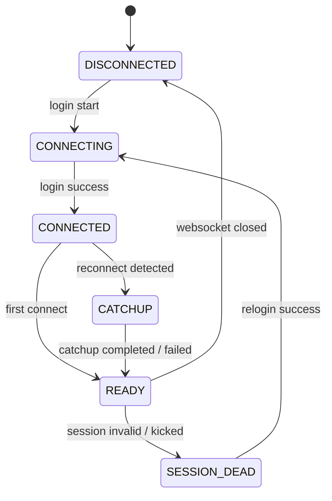

# Architecture Design Document: Reliable Message Recovery & Catch-up (v7)

## 📌 RFC 2119 Conformance Notice

The key words "MUST", "MUST NOT", "REQUIRED", "SHALL", "SHALL NOT", "SHOULD", "SHOULD NOT", "RECOMMENDED", "MAY", and "OPTIONAL" in this document are to be interpreted as described in [RFC 2119](https://www.ietf.org/rfc/rfc2119.txt).

---

## 📌 Context & Architecture Assumptions

Giao diện tích hợp `zca-js` không cung cấp cơ chế replay các sự kiện WebSocket bị bỏ lỡ. Khi kết nối WebSocket bị rớt trong lúc `retryOnClose`/auto-relogin, các tin nhắn gửi tới trong khoảng thời gian này sẽ không được tự động phát lại qua listener. 

Vì vậy, Bridge Node.js **MUST** chủ động đọc lại lịch sử hội thoại để bù các khoảng trống dữ liệu sau khi kết nối được khôi phục.

---

## 🎯 Design Goals

* **Never lose live messages after reconnect:** Khôi phục tối đa các tin nhắn bị nhỡ trong khoảng thời gian socket bị gián đoạn.
* **Never crash due to corrupted checkpoint:** Đảm bảo Bridge Node.js tự động degrade gracefully nếu file checkpoint bị mất hoặc hư hỏng, tuyệt đối không crash tiến trình.
* **Upstream-driven replay ordering:** Bảo toàn nguyên bản thứ tự thời gian do upstream History API cung cấp.
* **Degrade gracefully under failures:** Tự động cô lập lỗi cấp độ thread hoặc API để duy trì sự phục vụ của toàn bộ hệ thống.
* **Zero thundering herd on upstream APIs:** Sử dụng queues, rate limiting và random jitter để bảo vệ tài khoản Zalo không bị khóa.

---

## 🔒 Security Considerations

* **No Credentials in Logs/Metrics:** Cookie, credentials, IMEI và token của Zalo **MUST NOT** xuất hiện trong log hoặc endpoint `/health` / `/metrics`.
* **No Content in Checkpoint/Metrics:** Nội dung văn bản tin nhắn, thông tin nhạy cảm của người dùng **MUST NOT** được lưu trữ vào file `thread_checkpoint.json` hoặc phơi bày qua `/health`.
* **Sanitized Checkpoint Output:** Path đĩa và thông tin checkpoint xuất ra `/health` chỉ chứa thông tin trạng thái Boolean (`loaded: true/false`), không rò rỉ cấu trúc đĩa nội bộ.

---

## 🧩 Compatibility

* **Node.js Environment:** Requires Node.js `>= 18.x` (Recommended `>= 20.x`).
* **Upstream Integration:** Compatible with `zca-js` API layer.
* **Hermes Agent Integration:** Fully backward-compatible with existing Python `ZaloAdapter` protocol.
* **Backward Configuration:** Default behavior remains identical if catch-up env vars are omitted.

---

## 🚫 Out of Scope

* **End-to-end ACK between Python Adapter & Node Bridge:** Checkpoint ở Bridge chỉ xác nhận tin nhắn đã được chuyển tiếp (`forwarded`), chưa xác nhận AI Agent đã xử lý xong.
* **Exactly-once delivery guarantee:** Hệ thống hướng tới At-Least-Once Delivery kết hợp Deduplication; không cam kết Exactly-Once ở mức giao thức hạ tầng.
* **Cross-device & Multi-account synchronization:** Không đồng bộ hóa trạng thái giữa nhiều tài khoản Zalo hoặc nhiều thiết bị chạy song song.
* **Distributed deployment / HA Clustering:** Bridge chạy ở dạng đơn tiến trình (Single-instance Bridge).

---

## ⚠️ Known Limitations

* **History API Depth Limitation:** Zalo History API chỉ trả về tối đa N tin nhắn gần nhất. Nếu Bridge rớt mạng quá lâu (vượt quá độ sâu history), một số tin nhắn quá cũ có thể không khôi phục được.
* **Forwarded Checkpoint Semantics:** Checkpoint **MUST** be advanced only after the message has been successfully forwarded to the downstream adapter (`forwardedCheckpoint`).
* **Upstream Schema Drift:** Nếu `zca-js` hoặc Zalo Web API thay đổi cấu trúc response của History API, luồng catch-up có thể cần cập nhật tương ứng.

---

## 💥 Failure Matrix

| Failure Mode | Root Cause / Trigger | Expected System Behavior |
|---|---|---|
| WebSocket Disconnect | Network glitch / Proxy drop | Trigger auto-reconnect (`retryOnClose`); transition to `DISCONNECTED`. |
| Checkpoint Corrupted | Unexpected power loss / Invalid JSON | Log warning, reset memory checkpoint to `{ version: 1, threads: {} }`, disable catch-up for session; Bridge process **MUST NOT** crash. |
| History API Timeout | Upstream Zalo server latency | Retry up to 3 times with exponential backoff & ±20% random jitter. |
| History Retry Exhausted | Persistent upstream API failure | Log `console.warn`, skip current thread, and continue catch-up for remaining threads. |
| Rate Limit Suspected | Excessive upstream API calls | Pause fresh info calls, apply exponential backoff (up to 5m), serve stale cache. |

---

## 📐 Reference Implementation Details

### 1. State Machine & Connection Lifecycle

Quản lý vòng đời kết nối bằng **Connection State Machine** với Diagram và Transition Table:



| Current State | Trigger Event | Next State | Description / Action |
|---|---|---|---|
| `DISCONNECTED` | `login success` | `CONNECTED` | WebSocket kết nối thành công |
| `CONNECTED` | `reconnect detected` | `CATCHUP` | Phát hiện vừa reconnect sau khi rớt mạng |
| `CONNECTED` | `first connect` | `READY` | Kết nối lần đầu khi khởi động app |
| `CATCHUP` | `catchup completed` | `READY` | Quét bù lịch sử hoàn tất, sẵn sàng phục vụ |
| `CATCHUP` | `catchup failed` | `READY` | Quét bù gặp lỗi, degrade xuống READY để nhận tin live |
| `READY` | `websocket closed` | `DISCONNECTED` | Socket ngắt ngẫu nhiên |
| `READY` | `session invalid` | `SESSION_DEAD` | Cookie hết hạn / bị kick bởi thiết bị khác |
| `SESSION_DEAD` | `relogin success` | `CONNECTED` | Quét QR hoặc relogin cookie thành công |

### 2. Upstream-Driven Replay Ordering Contract

* **Ràng buộc:** Bridge **MUST** preserve the ordering returned by the history API. If the upstream API contract changes, the replay ordering logic **MUST** be updated accordingly.
* Checkpoint **MUST** be advanced only after the message has been successfully forwarded to the downstream adapter.

### 3. Thread Scan Priority & Anti-Thundering Herd

* **Thứ tự ưu tiên:** Luồng catch-up 100 threads được sắp xếp ưu tiên: **Most recently active → Oldest**.
* **Retry Jitter:** Khi gọi API đọc lịch sử gặp lỗi, Retry theo công thức: `Backoff * (1 ± 20% random jitter)` (ví dụ: `1s ± 0.2s`, `2s ± 0.4s`, `4s ± 0.8s`).

### 4. Reserved Checkpoint Schema & Atomic Write

* File `thread_checkpoint.json` tuân thủ schema dự phòng field metadata:
  ```json
  {
    "version": 1,
    "bridgeVersion": "1.0.0",
    "createdAt": "2026-07-21T14:45:00Z",
    "updatedAt": "2026-07-21T14:45:00Z",
    "metadata": {},
    "threads": {
      "threadId_123": {
        "threadType": "user",
        "checkpoint": { "messageId": "msg_002", "timestamp": 1784616000000 },
        "updatedAt": 1784616000000
      }
    }
  }
  ```
* Thực hiện Atomic Write (`.tmp` → `renameSync`).

### 5. Diagnostics Endpoint (`/health` & `/metrics`)

`/health` hiện tại phục vụ cả diagnostics để đơn giản hóa kiến trúc. Một dedicated `/metrics` endpoint **MAY** được giới thiệu ở các RFC sau.

```json
{
  "ok": true,
  "version": "1.0.0",
  "bootId": "2a218f5d-95fe-4465-9cdb-b12777dd1a15",
  "uptime": 12345,
  "checkpoint": {
    "enabled": true,
    "loaded": true,
    "lastFlushAt": 1784616000000
  },
  "metrics": {
    "connection": {
      "state": "READY",
      "disconnectCount": 2,
      "lastDisconnectDurationMs": 3500,
      "keepAliveFailures": 0,
      "lastKeepAliveAt": 1784616000000
    },
    "catchup": {
      "running": false,
      "recoveredCount": 12,
      "historyFetchErrors": 0,
      "dedupDrops": 3,
      "catchupSkipped": 0,
      "lastCatchupAt": 1784616005000,
      "lastCatchupDurationMs": 420,
      "apiCallsCount": 3,
      "apiFailures": 0
    },
    "thread": {
      "tracked": 15,
      "pruned": 0
    }
  }
}
```

---

## 🗺️ Multi-PR Roadmap (6 PRs)

* **PR #1: Checkpoint Persistence Engine & Config Infrastructure**
* **PR #2: Connection Lifecycle & State Machine**
* **PR #3: Catch-up & Replay Engine**
* **PR #4: Health Diagnostics, Build Info & Error Metrics**
* **PR #5: Cross-Deduplication & Source Tagging**
* **PR #6: LRU Thread Pruning & Validation / Performance Suite**

---

## 🧪 Validation Strategy & Performance Evaluation

### A. Validation Strategy
1. **State Machine Validation:** Kiểm tra từng trigger event chuyển state theo State Machine Diagram.
2. **Replay Ordering Validation:** Kiểm tra tin nhắn history đến Hermes đúng chuẩn upstream order.
3. **Graceful Rollback Validation:** Xóa hoặc làm hỏng file checkpoint, xác minh Bridge chuyển `checkpoint.loaded = false` và chạy bình thường.
4. **Config Clamping Validation:** Truyền giá trị out-of-range, kiểm tra tự động clamp về default.

### B. Performance Evaluation
* **Target Benchmark Environment:** Node.js v20.x, Linux x64 / Windows 11 x64, 8GB RAM, 4 CPU Cores.
* **100 Threads Active Scenario:** Giả lập 100 threads active (1,000 tin nhắn replay), đo P95 Latency (Target: **P95 < 5000ms**).
* **Single Thread Burst Scenario (1 Thread / 5,000 Messages):** Giả lập 1 nhóm duy nhất bị spam 5,000 tin nhắn liên tục để phát hiện độ trễ replay, rò rỉ bộ nhớ và nghẽn CPU.
