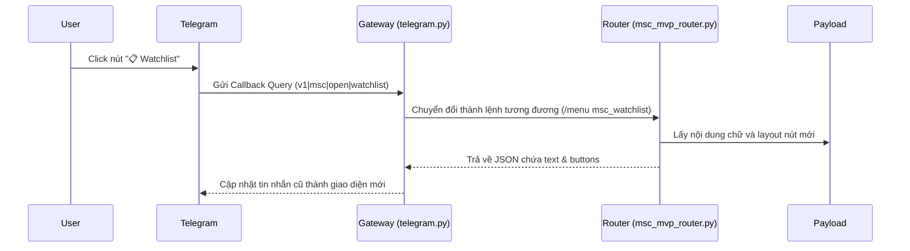

# 📱 Hướng dẫn Triển khai Inline Button Menu cho Skill trong Hermes

Tài liệu này hướng dẫn chi tiết cách thiết lập, lập trình và tích hợp giao diện nút bấm tương tác (Inline Button Menu) cho một Skill bất kỳ trên Telegram thông qua hệ thống **Hermes Agent**.

---

## 🏗️ Kiến trúc Tổng quan của Inline Menu

Hệ thống Inline Menu hoạt động dựa trên cơ chế phản hồi sự kiện (Callback Query) theo mô hình sau:



---

## 🛠️ Quy trình Triển khai (5 Bước)

### Bước 1: Khai báo lệnh `/menu` tương ứng trong CLI Registry
Để hệ thống nhận diện và tự động hoàn thành (autocomplete) lệnh menu mới:
1. Mở file [hermes_cli/commands.py](file:///d:/Antigravity/Hermes/hermes_cli/commands.py).
2. Thêm định nghĩa lệnh mới vào `COMMAND_REGISTRY`:
   ```python
   CommandDef("xsmenu", "Hiển thị menu tương tác Xổ số", "Tools & Skills", aliases=("xsbtn",)),
   ```

### Bước 2: Thiết kế Layout Nút bấm (`inline_menu_payload.py`)
Tạo một file định nghĩa layout nút bấm (ví dụ `skills/productivity/xs/lib/inline_menu_payload.py`):
*   Cấu trúc nút bấm là mảng 2 chiều đại diện cho hàng và cột.
*   `callback_data` có cấu trúc: `v1|<module>|<action>|<argument>` (độ dài tối đa 64 ký tự).

```python
def _build_inline_menu_payload(level: str = 'root') -> dict:
    lvl = (level or 'root').strip().lower()

    if lvl in ('root', 'main'):
        return {
            'text': '🔮 Xổ số Kiến thiết (XS)\n\nChọn tỉnh thành cần tra cứu:',
            'buttons': [
                [
                    {'text': ' miền Bắc', 'callback_data': 'v1|xs|run|mb'},
                    {'text': ' miền Nam', 'callback_data': 'v1|xs|open|mn'},
                ],
                [
                    {'text': ' miền Trung', 'callback_data': 'v1|xs|open|mt'},
                ],
            ],
            'meta': {'menu_level': 'root'}
        }
    
    # Định nghĩa các cấp độ menu con tại đây...
```

### Bước 3: Đăng ký Bộ định tuyến Callbacks (Router)
Trong tệp router của Skill (ví dụ `xs_router.py`):
1. **Chuẩn hóa lệnh đầu vào**: Đọc và bóc tách callback payload gửi về nếu đầu vào dạng callback:
   ```python
   def _normalize_incoming_command_text(raw_text: str) -> str:
       # Nếu chứa tiền tố "v1|xs|", ánh xạ sang lệnh tương ứng
       if raw_text.startswith('v1|xs|open|'):
           submenu = raw_text.split('|')[-1]
           return f'/xsmenu {submenu}'
       if raw_text.startswith('v1|xs|run|'):
           action = raw_text.split('|')[-1]
           return f'/xs {action}'
       return raw_text
   ```
2. **Xử lý lệnh `/xsmenu`**: Trả về cấu trúc JSON chứa text và nút bấm:
   ```python
   if cmd == 'xsmenu':
       payload = _build_inline_menu_payload(args or 'root')
       return {
           'status': 'ok',
           'command': 'menu',
           'result': {
               'text': payload['text'],
               'buttons': payload['buttons'],
               'meta': payload['meta']
           }
       }
   ```

### Bước 4: Đăng ký tiền tố Callback tại Gateway
Để Telegram Gateway không bỏ qua callback data của bạn:
1. Mở file [gateway/platforms/telegram.py](file:///d:/Antigravity/Hermes/gateway/platforms/telegram.py).
2. Tìm nơi xử lý `CallbackQuery` và thêm tiền tố của module bạn đăng ký (ví dụ `v1|xs|`):
   ```python
   if query_data.startswith("v1|xs|"):
       # Gửi payload sang cho telegram_menu_bridge xử lý
       # Bridge sẽ tự động gọi router của bạn và cập nhật tin nhắn
   ```

### Bước 5: Cấu hình Telegram Menu Bridge
Tệp `telegram_menu_bridge.py` đóng vai trò gọi Router của bạn dưới nền, nhận kết quả JSON chứa các nút bấm mới và gửi lệnh cập nhật giao diện tin nhắn cũ thông qua API của Telegram (`editMessageText`).

Đảm bảo rằng lệnh gửi đi giữ nguyên cấu trúc mảng nút 2 chiều `result.buttons`.

---

## 💡 Best Practices (Lưu ý quan trọng)

> [!IMPORTANT]
> **Giới hạn 64 ký tự của Callback Data**
> Telegram giới hạn trường `callback_data` của mỗi nút bấm tối đa **64 bytes**. Vui lòng thiết kế chuỗi callback ngắn gọn (Ví dụ: `v1|xs|open|mn` chỉ tốn 14 bytes).

> [!TIP]
> **Nút quay lại (Back Button)**
> Luôn luôn thiết kế nút quay lại trang menu cha để tăng trải nghiệm người dùng:
> ```python
> {'text': '⬅️ Quay lại', 'callback_data': 'v1|xs|open|main'}
> ```

> [!WARNING]
> **Unicode trên Windows**
> Khi hiển thị Emoji hoặc chữ có dấu tiếng Việt trên terminal Windows, hãy luôn khai báo đoạn code sau ở đầu script router:
> ```python
> import sys
> if sys.platform.startswith('win'):
>     sys.stdout.reconfigure(encoding='utf-8')
>     sys.stderr.reconfigure(encoding='utf-8')
> ```
