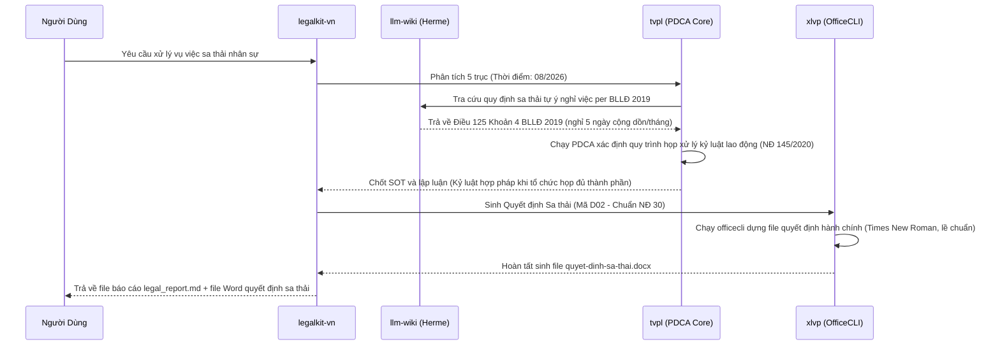

# Hướng Dẫn Phối Hợp Hệ Thống Pháp Lý & Văn Phòng Toàn Diện
## (LegalKit-VN × tvpl × xlvp × llm-wiki)

Tài liệu này hướng dẫn cách vận hành phối hợp giữa bộ công cụ **LegalKit-VN**, lõi **Tư vấn Pháp luật (tvpl)**, engine **Xử lý Văn phòng (xlvp - OfficeCLI)** và cơ sở tri thức **llm-wiki** của Herme-Agent để tạo ra một quy trình khép kín: **Tiếp nhận $\rightarrow$ Tra cứu & Lập luận $\rightarrow$ Soạn thảo văn bản chuẩn $\rightarrow$ QA**.

---

## 1. Bản Đồ Kiến Trúc Hệ Thống

```mermaid
flowchart TD
    User([Yêu cầu từ User]) --> Dispatcher{legalkit-vn: Mode Dispatcher}
    
    %% Các chế độ hoạt động
    Dispatcher -->|A: Research| ModeA[Chế độ A: Nghiên cứu Pháp lý]
    Dispatcher -->|B: Contract| ModeB[Chế độ B: Soạn Hợp đồng Mẫu]
    Dispatcher -->|C: Integrated| ModeC[Chế độ C: Tích hợp A + B]
    Dispatcher -->|D: Document| ModeD[Chế độ D: Soạn VB Hành chính NĐ 30]

    %% Tầng hỗ trợ kiến thức (Knowledge Base)
    ModeA & ModeC & ModeD -->|Tra cứu nhanh dữ liệu / Mẫu gốc| LLMWiki[(Herme-Agent: llm-wiki)]
    
    %% Tầng Engine xử lý đầu ra vật lý
    ModeB & ModeC & ModeD -->|Biên dịch sang DOCX/XLSX chuẩn| XLVP{xlvp: OfficeCLI Engine}
    
    %% Đầu ra sản phẩm
    ModeA & ModeC --> OutputReport[legal_report_[chủ_đề].md]
    ModeB & ModeC --> OutputContract[hop-dong_[loại].docx]
    ModeD --> OutputDoc[van-ban-hanh-chinh.docx]
```

---

## 2. Mô Tả Chi Tiết Các Thành Phần

### 2.1. Bộ Điều Phối: LegalKit-VN (`legalkit-vn`)
Là **Trọng tâm Điều phối (Super-Orchestrator)** chứa cổng nhận diện yêu cầu để phân loại tự động vào 4 chế độ vận hành:
*   **Chế độ A (Research):** Chỉ phân tích tình huống pháp lý, không yêu cầu sinh văn bản.
*   **Chế độ B (Contract):** Soạn thảo hợp đồng dựa trên thông tin có sẵn và 25 mẫu hợp đồng chuẩn.
*   **Chế độ C (Integrated):** Vừa nghiên cứu pháp lý vừa soạn thảo hợp đồng phù hợp.
*   **Chế độ D (Document):** Tạo lập văn bản hành chính (Công văn, Quyết định, Tờ trình,...) theo chuẩn thể thức của Nghị định 30/2020/NĐ-CP.

### 2.2. Lõi Lập Luận Pháp Lý: Tư Vấn Pháp Luật (`tvpl`)
Là nhân tố cốt lõi xử lý lập luận ở **Chế độ A** và **Chế độ C** dựa trên nguyên lý **PDCA Cascade**:
*   **Xác định 5 trục tọa độ pháp lý:** Đối tượng, Hành vi, Tác động, Phạm vi, và **Thời điểm** (Thời điểm quyết định văn bản quy phạm pháp luật nào đang có hiệu lực áp dụng).
*   **Xây dựng SOT (Source of Truth):** Quản lý tập trích dẫn nguyên văn luật có tọa độ chính xác (Văn bản – Số hiệu – Điều – Khoản – Điểm).
*   **Giải quyết xung đột pháp lý:** Dựa trên các quy tắc *Lex superior* (VB cấp cao hơn), *Lex posterior* (VB mới hơn), và *Lex specialis* (VB chuyên ngành).

### 2.3. Bộ Nhớ Tri Thức: `llm-wiki` (Herme-Agent)
Đóng vai trò là **Cơ sở dữ liệu hỗ trợ tra cứu nhanh**:
*   Thay vì tìm kiếm diện rộng trên Web dễ bị nhiễu hoặc sai lệch thông tin, Herme-Agent sử dụng `llm-wiki` để truy quét trước các tài liệu hướng dẫn nội bộ, cẩm nang pháp luật, hoặc tóm tắt quy định cốt lõi.
*   Cung cấp cấu trúc khung xương sống cho các nhóm lĩnh vực (Dân sự, Hình sự, Doanh nghiệp, Lao động, Đất đai, Thuế).

### 2.4. Engine Tái Tạo Văn Bản: Xử lý Văn phòng (`xlvp` - OfficeCLI)
Đóng vai trò là **Bộ xử lý vật lý đầu ra**:
*   Không chỉnh sửa trực tiếp trên file cũ, `xlvp` bóc tách dữ liệu (`dump`) và tái cấu trúc thành file mới qua `officecli`.
*   **Đường ray đôi (Dual-Track):**
    *   *Track 1 (Chuẩn Hành chính Quốc gia NĐ 30):* Áp dụng nghiêm ngặt cho văn bản hành chính nhà nước (Công văn, Quyết định, Tờ trình). Định dạng đen trắng, font Times New Roman, căn lề chuẩn 3cm - 1.5cm - 2cm - 2cm.
    *   *Track 2 (Chuẩn Thẩm mỹ Hiện đại):* Áp dụng cho các tài liệu thương mại, Pitch deck, Slide thuyết trình doanh nghiệp (có tích hợp Brand Kit, phối màu).

---

## 3. Quy Trình Vận Hành Phối Hợp 4 Bước

### Bước 1: Tiếp nhận & Phân loại (Legalkit Dispatcher)
Khi nhận yêu cầu từ người dùng, Agent kiểm tra từ khóa và mục tiêu để định hướng Chế độ:
1. Xác định 5 trục tọa độ pháp lý (Đối tượng, Hành vi, Tác động, Phạm vi, Thời điểm).
2. Chọn Chế độ phù hợp: **A**, **B**, **C**, hoặc **D**.

### Bước 2: Tra cứu & Xây dựng Căn cứ Pháp lý (tvpl + llm-wiki)
1. Sử dụng **`llm-wiki`** để truy vấn nhanh các luật/nghị định nền tảng liên quan đến từ khóa của 5 trục tọa độ.
2. Thiết lập bảng **SOT thô (Raw SOT)** trong file nhật ký `legal_phase_X.md`.
3. Chạy vòng lặp **PDCA Cascade** (tìm kiếm bổ sung qua `search_web` nếu cần $\rightarrow$ Trích dẫn nguyên văn $\rightarrow$ Kiểm tra xung đột hiệu lực $\rightarrow$ Cập nhật SOT).

### Bước 3: Biên soạn & Vật chất hóa Văn bản (xlvp)
*Nếu chế độ yêu cầu sinh văn bản (Hợp đồng ở Chế độ B/C hoặc Văn bản hành chính ở Chế độ D):*
1. **Lấy dữ liệu đầu vào:** Toàn bộ căn cứ pháp lý đã chốt trong SOT ở Bước 2 sẽ được đưa vào phần căn cứ ban hành của văn bản.
2. **Kích hoạt mẫu chuẩn:** Đọc file mẫu tương ứng (ví dụ: mẫu hợp đồng `B06-hdld-khong-xd.md` hoặc quy chuẩn công văn `D01`).
3. **Gọi OfficeCLI để dựng file:**
   ```powershell
   officecli create [tên_file].docx
   officecli set [tên_file].docx / --prop docDefaults.font="Times New Roman"
   # Thao tác add/set nội dung chi tiết...
   ```

### Bước 4: Kiểm tra Chất lượng (QA) & Bàn giao
1. **Validate định dạng:** Chạy `officecli validate [tên_file].docx` và `officecli view [tên_file].docx issues` để tự động dò tìm lỗi định dạng.
2. **Bàn giao đầu ra:**
   *   Tạo file báo cáo pháp lý `legal_research_[chủ_đề]/legal_report_[chủ_đề].md` cấu trúc 5 phần (Tóm tắt, Bảng SOT, Phân tích phương án, Khuyến nghị, Cảnh báo/Disclaimer).
   *   Cung cấp đường dẫn tải file văn bản `.docx` hoặc `.xlsx` đã sinh.

---

## 4. Ví Dụ Thực Tế Luồng Tích Hợp (Chế độ C)

> [!NOTE]
> **Tình huống:** Công ty muốn sa thải một nhân sự tự ý nghỉ việc 5 ngày liên tục không có lý do chính đáng trong tháng 8/2026. Hãy tư vấn và soạn thảo Quyết định kỷ luật sa thải.



---

## 5. Danh Sách Kiểm Tra Chất Lượng (Quality Gate)

Để đảm bảo kết quả đầu ra hoàn hảo, mọi quy trình phải được kiểm soát qua 15 điểm:
*   [ ] Đã định vị đúng chế độ xử lý (A/B/C/D) chưa?
*   [ ] Trục **Thời điểm** đã được xác định chính xác để đối chiếu hiệu lực văn bản pháp lý?
*   [ ] SOT có tối thiểu 3 trích dẫn nguyên văn với đầy đủ tọa độ pháp lý?
*   [ ] Đã giải quyết xung đột luật (nếu có) trước khi đưa ra phương án hành động?
*   [ ] Các văn bản soạn thảo có tuân thủ đúng định dạng của xlvp (Times New Roman cho hành chính NĐ 30, hoặc Brand Kit cho Doanh nghiệp)?
*   [ ] Đã chạy lệnh kiểm tra tự động `officecli view issues` trước khi giao file?
*   [ ] Có disclaimer bắt buộc ở cuối báo cáo và hợp đồng chưa?
