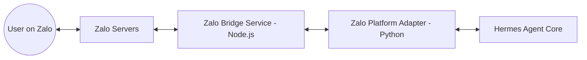

# Kế hoạch Tích hợp Zalo vào Hermes Agent (Zalo Platform Adapter)

**Nguồn tham khảo chính:** [monasprox/zaloclaw](https://github.com/monasprox/zaloclaw) & thư viện `zca-js`.

## 1. Mục tiêu
- Chat trực tiếp với Hermes trên Zalo (Personal hoặc Group).
- Hermes có khả năng gửi tin nhắn văn bản, hình ảnh và file qua Zalo.
- Đảm bảo tính ổn định và bảo mật session (Zalo cookies/tokens).

## 2. Kiến trúc Đề xuất (Zalo-to-Hermes Bridge)

Do Zalo sử dụng giao thức riêng phức tạp và thư viện tốt nhất hiện tại (`zca-js`) viết bằng Node.js, chúng ta sẽ sử dụng kiến trúc **Bridge Service**.



### Thành phần 1: Zalo Bridge Service (Node.js)
- **Công nghệ**: Node.js, Express, `zca-js`.
- **Nhiệm vụ**: 
    - Duy trì đăng nhập Zalo (qua QR Code hoặc Cookie).
    - Nhận tin nhắn từ Zalo và đẩy về Hermes qua Webhook.
    - Cung cấp API nội bộ cho Hermes gửi tin nhắn ngược lại Zalo.

### Thành phần 2: Zalo Platform Adapter (Python)
- **Vị trí**: `gateway/platforms/zalo.py`.
- **Nhiệm vụ**:
    - Kế thừa `BasePlatform` của Hermes.
    - Xử lý các sự kiện `inbound_message` từ Zalo Bridge.
    - Chuyển đổi định dạng tin nhắn của Zalo sang định dạng chuẩn của Hermes.

---

## 3. Lộ trình Triển khai (Phases)

### Giai đoạn 1: Xây dựng Zalo Bridge (Node.js)
1. Khởi tạo dự án Node.js mới trong `gateway/zalo_bridge`.
2. Tích hợp thư viện `zca-js` (tương tự cách `zaloclaw` thực hiện).
3. Viết module **Authentication**: Hỗ trợ quét mã QR để lấy Cookie.
4. Viết module **Message Listener**: Bắt sự kiện tin nhắn mới và chuyển tiếp tới Hermes.
5. Viết **API Endpoints**: `/send_text`, `/send_image`, `/send_file`.

### Giai đoạn 2: Phát triển Hermes Zalo Adapter (Python)
1. Tạo file `gateway/platforms/zalo.py`.
2. Implement các hàm:
    - `start()`: Khởi động bridge và kiểm tra kết nối.
    - `send_message()`: Gọi API của Zalo Bridge để gửi tin.
    - `handle_webhook()`: Nhận dữ liệu từ Bridge và đưa vào hàng đợi xử lý của Agent.
3. Đăng ký nền tảng `zalo` trong `gateway/run.py`.

### Giai đoạn 3: Cấu hình & Bảo mật
1. Cấu hình trong `config.yaml`:
   ```yaml
   gateway:
     platforms:
       zalo:
         enabled: true
         bridge_url: "http://localhost:3001"
         webhook_secret: "..."
   ```
2. Lưu trữ Cookie Zalo an toàn trong thư mục `.hermes/data/zalo_session`.

---

## 4. Các thách thức kỹ thuật cần xử lý
- **Duy trì Session**: Zalo hay bắt đăng nhập lại. Cần cơ chế tự động làm mới session hoặc thông báo qua Telegram/Email khi cần quét lại QR.
- **Tốc độ (Rate Limit)**: Tránh gửi tin quá nhanh dẫn đến bị khóa tài khoản Zalo.
- **Media**: Chuyển đổi định dạng ảnh/file giữa Hermes và Zalo (Zalo yêu cầu upload lên server của họ trước khi gửi).

## 5. Kết luận
Sử dụng kiến trúc Bridge dựa trên `monasprox/zaloclaw` là hướng đi khả thi nhất. Nó giúp tận dụng được sức mạnh xử lý giao thức Zalo của Node.js mà vẫn giữ được logic thông minh của Hermes trong Python.

---
*Ghi chú: Việc sử dụng các thư viện reverse-engineer như `zca-js` có rủi ro về mặt chính sách của Zalo. Khuyến khích sử dụng tài khoản phụ để thử nghiệm.*
